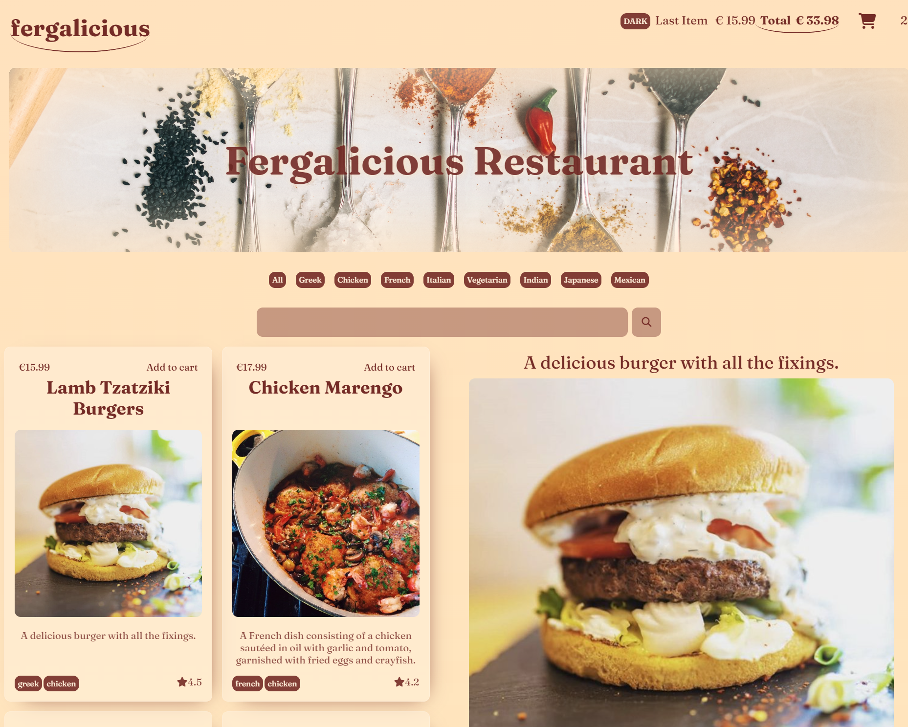

# Dark Kitchen Online Delivery Project - Fergelishos

## Description

This is a dynamic single-page restaurant menu application, built as part of the BeCode challenges. The application is designed for a Dark Kitchen online delivery service and includes a list of dishes that users can order online.

The team working on this project includes Oana, Louis and Florentina.

## Features

- **Responsive Design**: The application is designed to work on both mobile and desktop resolutions.
- **Dish Listing**: Each dish is listed with its own card, including details such as image, name, price, and description.
- **Dish Categorization**: Dishes can be filtered based on categories.
- **Shopping Cart**: Users can add dishes to a shopping cart, view the selected dishes, and see the total amount for delivery.
- **Dark Mode**: A dark mode switch is provided, allowing users to toggle between light and dark modes.

## Technologies Used

- HTML
- CSS
- JavaScript

## Live : [fergalicious Restaurant](https://fergalicious.netlify.app/ )
## Preview:

